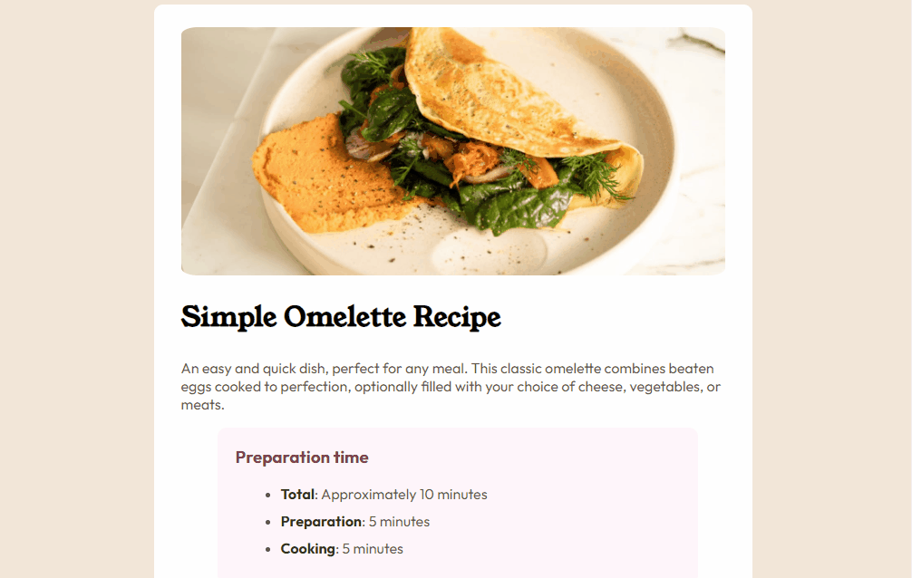
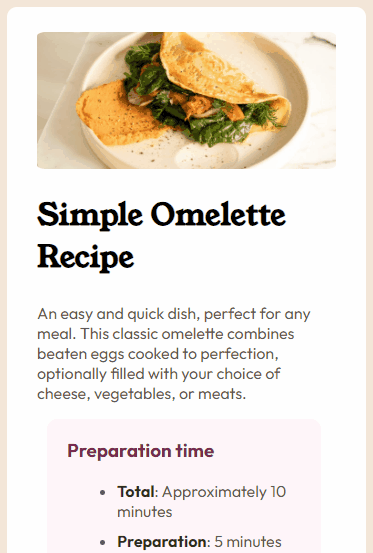

# Página de Receita 🍕🌭

## Essa página é fruto de um desafio do Frontend Mentor afim de aplicar os conhecimentos adquiridos no meus estudos.
Nesse desafio foram utilizados HTML e CSS e também aplicado o conceito de responsividade para aparelhos móveis.

Funcionamento da página na versão desktop

Funcionamento da página mobile

